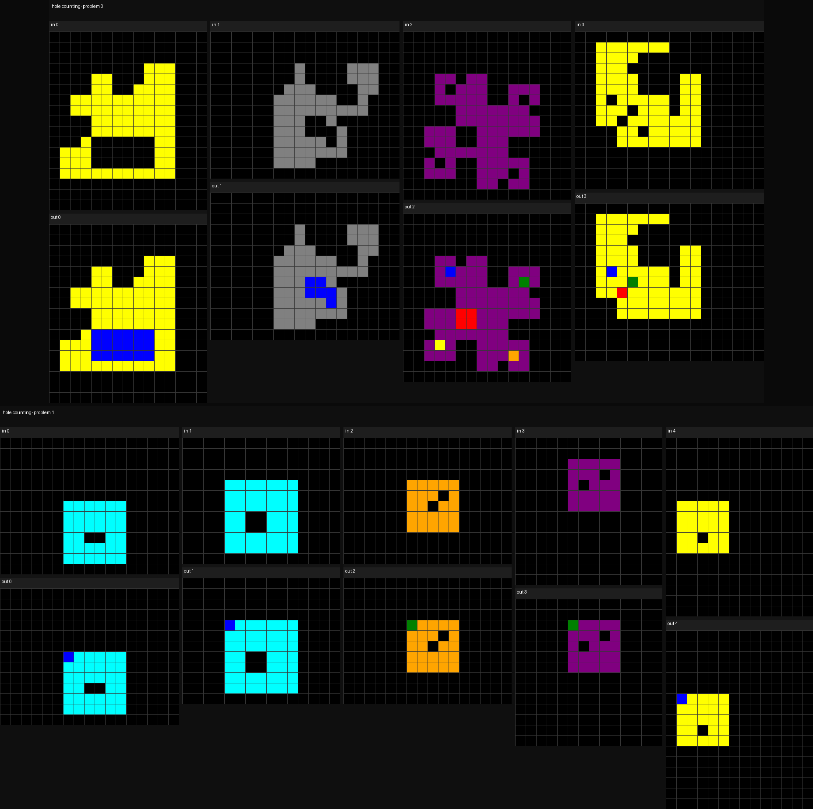

# ArcMemo: Abstract Reasoning Composition with Lifelong LLM Memory

We introduce a lightweight LLM memory framework emphasizing higher-level abstraction and modularity to continually improve at compositional reasoning.

## Abstract
While inference-time scaling enables LLMs to carry out increasingly long and capable reasoning traces, the patterns and insights uncovered during these traces are immediately discarded once the context window is reset for a new query. External memory is a natural way to persist these discoveries, and recent work has shown clear benefits for reasoning-intensive tasks. We see an opportunity to make such memories more broadly reusable and scalable by moving beyond instance-based memory entries (e.g. exact query/response pairs, or summaries tightly coupled with the original problem context) toward concept-level memory: reusable, modular abstractions distilled from solution traces and stored in natural language. For future queries, relevant concepts are selectively retrieved and integrated into the prompt, enabling test-time continual learning without weight updates. Our design introduces new strategies for abstracting takeaways from rollouts and retrieving entries for new queries, promoting reuse and allowing memory to expand with additional experiences. On the challenging ARC-AGI benchmark, our method yields a 7.5% relative gain over a strong no-memory baseline with performance continuing to scale with inference compute. We find abstract concepts to be the most consistent memory design, outscoring the baseline at all tested inference compute scales. Moreover, we confirm that dynamically updating memory during test-time outperforms an otherwise identical fixed memory setting with additional attempts, supporting the hypothesis that solving more problems and abstracting more patterns to memory enables further solutions in a form of self-improvement.

## Repository Structure
- `concept_mem/`: the main package containing the implementation of the ArcMemo framework.
- `notebooks/` (under construction): contains python notebooks for supporting experiments, visualization, and analysis.
- `configs`/: We use [Hydra](https://hydra.cc/) for configuration management. The `configs` directory contains all the configuration files used in our experiments.
- `data/`: contains data files used in the experiments.
- `requirements.txt`: lists the Python dependencies required to run the code.

## Usage
Again we rely on hydra for managing experiments, the following examples highlight the main entry points and scripts to run:

### Baseline (No Memory)
```bash
# running puzzle solving in our harness
python -m concept_mem.evaluation.driver \
  data=val100 \
  model=o4_mini \
  generation=long_cot_defaults \
  generation.ignore_cache=true \
  puzzle_retry.max_passes=3 \
  generation.n=1
```

### ArcMemo-PS
Here are some example commands to run the ArcMemo pipeline.

Initialize Memory
```bash
# preprocess seed solutions into pseudocode (produces initial_analysis.json)
python -m concept_mem.memory.v4.pseudocode \
	+annotate=default \
	annotate.limit_problems=null

# abstract memories
# - pseudocode output by the previous step
# - hand annotations as fewshot examples
python -m concept_mem.memory.v4.abstract \
	+annotate=default \
	annotate.pseudocode=".../initial_analysis.json" \
	annotate.hand_annotations_file="data/abstract_anno/op3/op3a.yaml" \
	annotate.batch_size=1
```

Abstracting memories outputs a ConceptMem json file.
To get the memory into a fixed string, load from the file and write use the `to_string` method.
See `notebooks/memory_compression.ipynb` to see extra preprocessing details (querying model to summarize long entries, etc.).
```python
cm = ConceptMemory()
cm.load_from_file(latest_dir / "memory.json")

target_mem_str_path = DATA_DIR / "abstract_anno/op3/barc_init_mem.txt"
target_mem_str_path.write_text(cm.to_string())
```

Next for puzzle solving we (1) select relevant memories (2) run inference
```bash
# select memories
python -m concept_mem.memory.v4.select \
	model@selection.model=o4_mini \
	generation@selection.generation=long_cot_defaults \
	selection.problems="data/testbeds/validation_n100_uids.json.json" \
	selection.mem_str_path="data/abstract_anno/op3/barc_init_mem.txt" \
	selection.mem_path="data/memory/compressed_v1.json" 

# run inference (puzzle solving)
python -m concept_mem.evaluation.driver \
  data=val100 \
  prompt.problem_data=".../prompt_info.json" \
  model=o4_mini \
  generation=long_cot_defaults \
  generation.ignore_cache=true \
  prompt.hint_template_key="op3a" \
  puzzle_retry.max_passes=3 \
  generation.n=3
```

The key preprocessing step is formatting `problem_data` for the final inference step.
This is where concepts and other information to be included in context is organized.
The shape of the problem data json file is as follows:
```
{
    "[problem_uid]": {
        # note: we allow multiple different prompts to be run in parallel
        "[parallel_run_name]": {
            "hint": "[concepts string]",
            # description is optional
            "description": "[problem description",
        }
    }
    ...
}
```

## Reproducing Other Experiments

### Cheatsheet
First initialize the cheatsheet from seed solutions:
```bash
python -m concept_mem.memory.cheatsheet.bootstrap \
	+annotate=default \
	+annotate.data.limit_problems=null \
	annotate.generation.max_tokens=4096
```
Then format cheatsheet contents into problem data (add the same cheatsheet to all problems):
```python
frozen_barc_cheatsheet_pi = {}
for k in val100.keys():
    frozen_barc_cheatsheet_pi[k] = {
        "frozen_barc_cheatsheet": {
            "hint": final_cheatsheet,
        }
    }
target_path = cheatsheet_output_dir / "frozen_barc_cheatsheet_pi.json"
with open(target_path, "w") as f:
    json.dump(frozen_barc_cheatsheet_pi, f, indent=2)
```
Then run inference as before:
```bash
python -m concept_mem.evaluation.driver \
  data=val100 \
  prompt.problem_data=".../frozen_barc_cheatsheet_pi.json" \
  model=o4_mini \
  generation=long_cot_defaults \
  generation.ignore_cache=true \
  prompt.hint_template_key="cheatsheet_min" \
  puzzle_retry.max_passes=3 \
  generation.n=1
```

### ArcMemo-OE
```bash
# generate post-hoc thought processes from seed solutions:
python -m concept_mem.abstraction.thought_process \
	+abstraction=default_thought_process

# abstract into analytical lessons (situation-suggestion pairs)
python -m concept_mem.abstraction.analysis_concepts \
	model=gpt41 \
	+abstraction=default_lesson_from_trace \
	abstraction.thought_processes=".../thought_processes.json"

# generate VLM puzzle descriptions
python -m detective.description.run \
	model=gpt41 \
	data=val30 \
	module=desc

# select concepts
python -m concept_mem.selection.description.select \
  selection.description_file=".../gpt41_vlm.json" \
  model@selection.model=gpt41 \
  selection.generation.temperature=0

# create problem data (as before)
...
# run inference (as before)
...
```

### ArcMemo-OE (Continual)
```bash
# use a different evaluation driver this time for puzzle solving
python -m concept_mem.evaluation.continual_driver \
  data=val100 \
  continual_batch_size=10 \
  concept_mem_init_file="[lesson json file path, output from analysis_concepts.py]" \
  +abstraction=default_lesson_from_trace \
  abstraction.thought_processes="[thought process json file path, output from thought_process.py]" \
  model=o4_mini \
  generation=long_cot_defaults \
  puzzle_retry.max_passes=3 \
  puzzle_retry.reselect_concepts=true \
  generation.n=1
```

## Oracle@k Scoring
Please refer to `notebooks/scoring_tutorial.ipynb` for aggregating results across runs and computing oracle@k scores.


## Dataset
We release our concept annotations and a self-contained helper-puzzle generation pipeline under `data/dataset/`.
The pipeline converts hand-written concepts into BARC-style descriptions, code, and validated problems, with
visualization and consolidation utilities.

### Layout
- `data/dataset/src/`: finalized pipeline (Concept → Description → Code → Problems)
  - `config.yaml`: pipeline configuration (paths are relative to this folder)
  - `prompts/concept_to_description.md`: Stage A template; optional few-shots in `fewshot/`
  - `BARC/`: local BARC code for Stage B/C (codegen, problem generation, prompts, seeds)
  - `scripts/`: orchestration and tools — `pipeline.py` (stages listed below), `render.py`
  - `data/`: inputs (`clean_concepts_filled.csv/.yaml`); `target.csv` for writing helper references
  - `outputs/`: artifacts written here (`descriptions/`, `code/`, `problems/`, `problems/by_concept/`, `viz/`, `viz_by_concept/`, `logs/`)
  - `setup_api_key.sh`: helper to export `OPENAI_API_KEY` and `OPENAI_MODEL`

### Prerequisites
- Python 3.11
- From project root, install dependencies:
```bash
pip install -r requirements.txt
```
- Export API keys (example):
```bash
source data/dataset/src/setup_api_key.sh
```

### Inputs
- `data/dataset/src/data/clean_concepts_filled.csv`: annotated concept table (primary input)

### Outputs
- `data/dataset/src/outputs/problems/by_concept/*.jsonl`: per-concept helper problem files (primary dataset artifact to use directly)
- `data/dataset/src/outputs/viz_by_concept/*.png`: visualizations corresponding to the above helpers

These two folders are the primary dataset contribution and can be used immediately for training, evaluation, or inspection without rerunning the pipeline.

#### BARC integration
The helper-grid generation pipeline adapts the BARC codebase for Stage B/C (description → code, code → problems). We vendor a truncated local copy under `data/dataset/src/BARC` (unused components removed) with light modifications to support our retry/consolidation flow and per‑concept outputs (`outputs/problems/by_concept`, `outputs/viz_by_concept`). The original project is available at [BARC](https://github.com/xu3kev/BARC).

#### Example (helper visualization)


### Usage (run from project root)
- Retry mode (per-row or mini-batch until success/limit)
```bash
python -m data.dataset.src.scripts.pipeline --stage retry
```
- Visualize helpers (renders by_concept JSONLs)
```bash
python -m data.dataset.src.scripts.pipeline --stage viz_helpers
```
Additional modes (e.g., descriptions, code, problems, consolidate, progress) are part of the same pipeline and are documented in `data/dataset/src/instruction.md`.

### Configuration
Edit `data/dataset/src/config.yaml` to customize:
- `src.concepts_csv` and `src.target_csv`
- Stage A (`src.stage_a`): model, few-shots, prompt, outputs
- Stage B (`src.stage_b`): BARC paths/models, `num_samples`, `num_seeds`, caching/parallelism
- Stage C (`src.stage_c`): `num_input_grids`, determinism/color checks, outputs
- Visualization (`src.viz`, `src.viz_helpers`), consolidation, and logging
